# 🚀 ООП Практика –Гунченко Владислава В'ячеславівна

## 📚 Загальна інформація

- **Студентка:** Гунченко Владислава В'ячеславівна  
- **Група:**35 група
-  **Підгрупа:** 1 підгрупа(Олійник В.В.)
- **Мова програмування:** Java  

---
# 📚 Практичні завдання

## 🔹 Завдання 1 – Аргументи командного рядка

### Мета:
Розробити програму для роботи з аргументами командного рядка.

### Реалізовано:
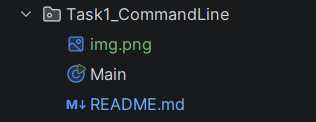
- Виведення аргументів
- Перевірка їх наявності
- Обробка введених значень
## Результат роботи
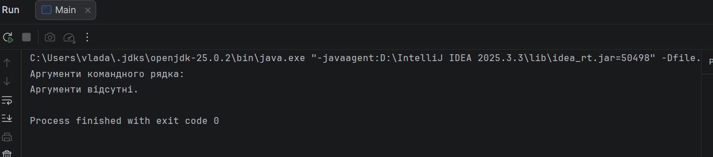
---

## 🔹 Завдання 2 – Серіалізація та агрегування
3 варіант
### Мета:
- Розробити Serializable клас
- Реалізувати агрегування
- Продемонструвати використання transient
- Здійснити збереження та відновлення об'єкта
- Створити тестовий клас

### Реалізовано:
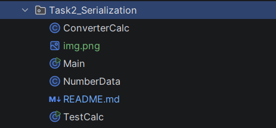
- `NumberData` – клас, що серіалізується
- `ConverterCalc` – клас з агрегуванням
- Методи `save()` та `restore()`
- Демонстрація роботи transient поля
- `Main` – діалоговий режим
- `TestCalc` – перевірка коректності серіалізації
#### Результат виконання програми:
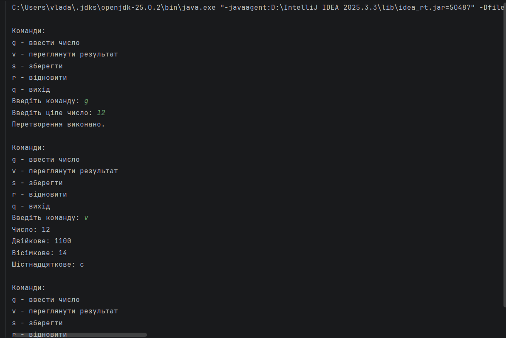
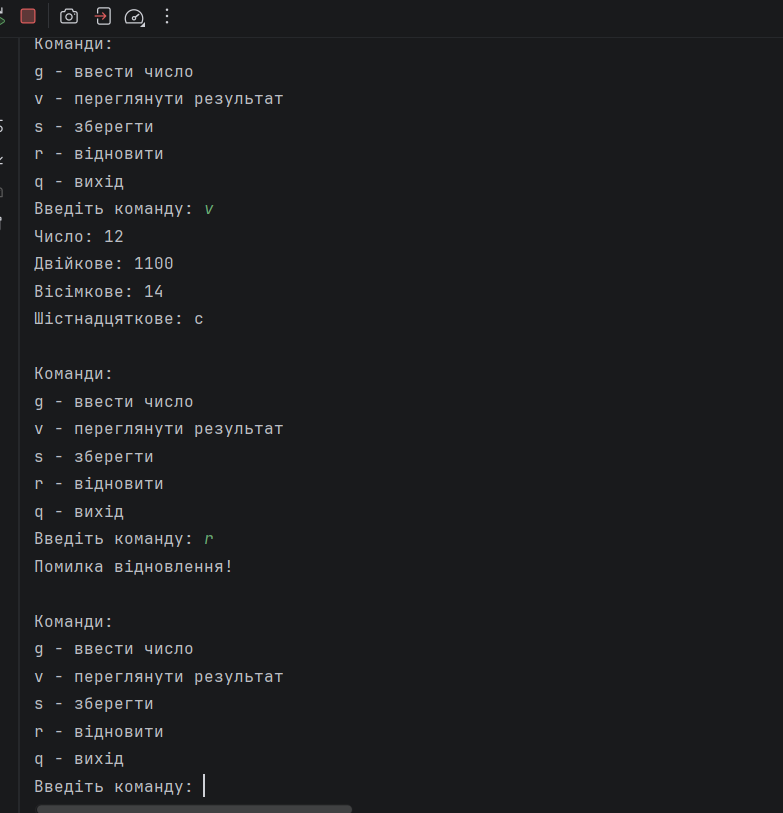
---

### 🔹 Завдання 3 – Спадкування (Factory Method)

#### Мета:

- Використати результати попередньої лабораторної роботи
- Реалізувати збереження результатів у колекції
- Використати шаблон проєктування Factory Method (Virtual Constructor)
- Реалізувати ієрархію класів для розширення системи
- Створити інтерфейс для відображення результатів

#### Реалізовано:
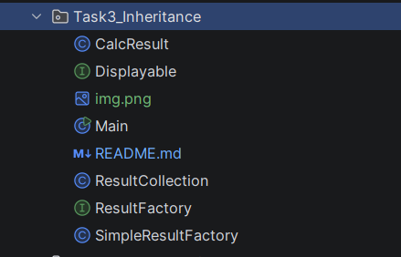
- `Displayable` – інтерфейс для відображення результатів
- `CalcResult` – клас результату обчислення
- `ResultCollection` – колекція для збереження результатів
- `ResultFactory` – інтерфейс фабрики
- `SimpleResultFactory` – реалізація Factory Method
#### Результат виконання програми:
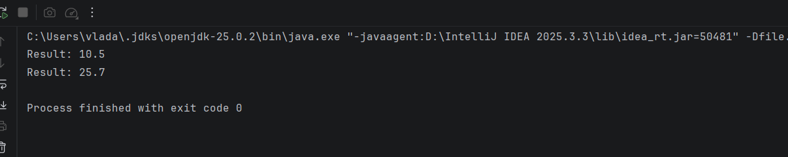
  ---

### 🔹 Завдання 4 – Поліморфізм (Factory Method)

#### Мета:

- Набути практичних навичок використання поліморфізму
- Реалізувати перевизначення методів (overriding)
- Реалізувати перевантаження методів (overloading)
- Продемонструвати динамічне зв'язування (dynamic method dispatch)
- Реалізувати форматований вивід результатів у вигляді таблиці
- Створити тестовий клас

#### Реалізовано:
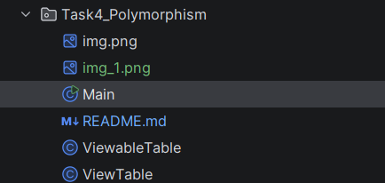
- `ViewTable` – клас для відображення результатів у вигляді таблиці
- `ViewableTable` – фабрика створення відображення (Factory Method)
- перевизначення методів (overriding)
- перевантаження методів (overloading)
- використання поліморфізму
- діалоговий інтерфейс з користувачем
- тестовий клас `MainTest`

#### Результат виконання програми:
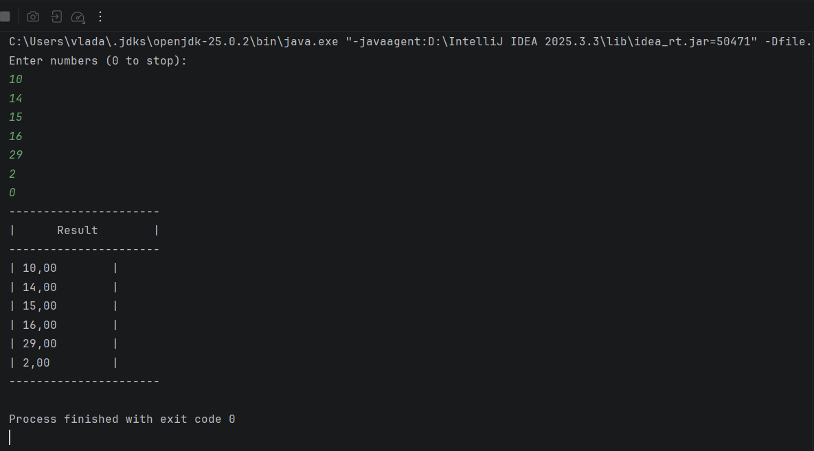

---

# 🔹 Завдання 5 – Обробка колекцій (Command, Singleton)

## Мета:

Розробити програму для обробки колекції об'єктів із використанням шаблонів проєктування **Command** та **Singleton**.

## Реалізовано:

- Реалізовано шаблон **Command** для обробки команд користувача
- Створено клас **Menu** як контейнер команд (MacroCommand)
- Реалізовано шаблон **Singleton** у класі `Application`
- Реалізовано **консольний діалоговий інтерфейс**
- Додано можливість **скасування останньої операції (Undo)**
- Реалізовано **JUnit тестування**

---
## Тестування

Для перевірки роботи команд створено клас:
Тести перевіряють:

- коректність ключів команд
- правильність відображення назв команд
## Основні класи
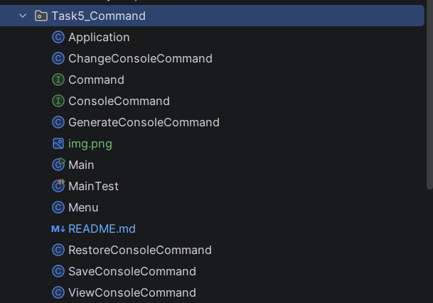
- `Application` – керування програмою (Singleton)
- `Menu` – контейнер команд (MacroCommand)
- `Command` – інтерфейс команди
- `ConsoleCommand` – інтерфейс консольної команди
- `GenerateConsoleCommand` – команда генерації
- `ViewConsoleCommand` – команда перегляду
- `ChangeConsoleCommand` – команда зміни
- `SaveConsoleCommand` – команда збереження
- `RestoreConsoleCommand` – команда відновлення
- `Main` – запуск програми
- `MainTest` – тестування

---

## Доступні команди

| Команда | Дія |
|-------|------|
| g | Generate |
| v | View |
| c | Change |
| s | Save |
| r | Restore |
| u | Undo |
## Приклад результату
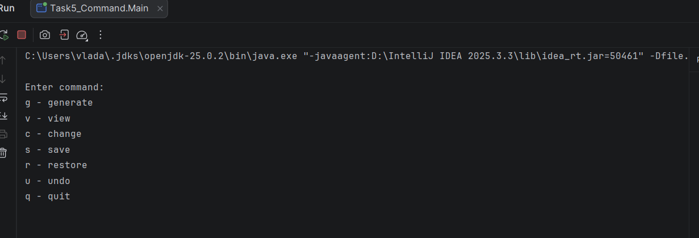

---

# Завдання 6 – Паралельне виконання
## Мета
Продемонструвати паралельну обробку елементів колекції та використання шаблону Worker Thread.

## Реалізовано

- Обчислення максимального значення
- Обчислення середнього значення
- Пошук мінімального та максимального значення
- Паралельне виконання задач
- Черга команд (CommandQueue)
- Використання шаблону **Worker Thread**

## Структура
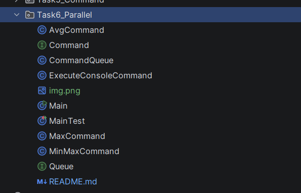
- `Command` – інтерфейс команди
- `AvgCommand` – обчислення середнього значення
- `MaxCommand` – пошук максимального значення
- `MinMaxCommand` – пошук мінімуму та максимуму
- `CommandQueue` – черга задач
- `Main` – запуск програми

## Приклад результату

|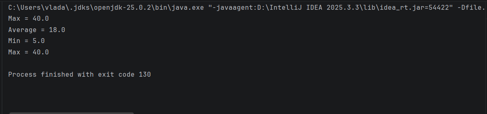 
---

# Завдання 7 – Графічний інтерфейс та шаблон Observer

У даній практичній роботі було реалізовано програму на Java, яка демонструє використання шаблону проектування **Observer**, власних **анотацій**, механізму **Reflection**, а також створення **графічного інтерфейсу за допомогою Swing**.
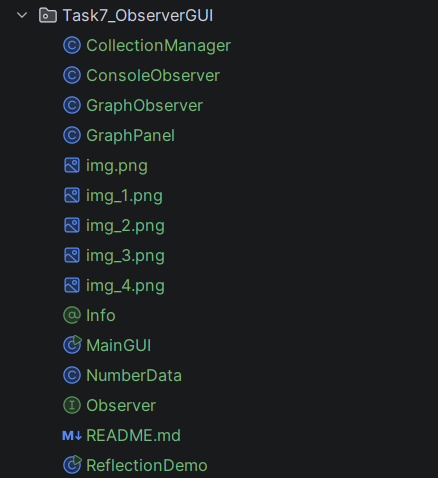
Програма працює з колекцією числових значень та відображає їх у вигляді **стовпчикового графіка**.  
Користувач може вводити нові значення, після чого графік автоматично оновлюється.

Для організації взаємодії між компонентами використано шаблон **Observer**.

---

## Структура програми

Observable (об'єкт, за яким спостерігають):

**CollectionManager**

Відповідає за:
- зберігання колекції чисел
- додавання нових значень
- повідомлення спостерігачів про зміну даних

---

Observers (спостерігачі):

**ConsoleObserver**

Відслідковує зміну колекції та виводить повідомлення у консоль.

**GraphObserver**

Відповідає за оновлення графіка та перемальовує графічну панель при зміні даних.

---

## Графічний інтерфейс

Графічний інтерфейс реалізовано за допомогою **Java Swing**.

Основні можливості програми:

- відображення чисел у вигляді стовпчикового графіка
- використання пастельних кольорів для стовпчиків
- підпис значень під графіком
- рамка області графіка
- вісь значень
- можливість вводити нові числа

Після введення нового значення графік автоматично оновлюється.

---

## Приклад роботи програми

### Графічний інтерфейс програми

---

### Введення нового значення користувачем

---

### Оновлення графіка після додавання значення

---

## Анотації

У програмі створено власну анотацію:

`@Info`

Анотація використовується у класі **NumberData** для збереження інформації про автора.

---

## Reflection

Для отримання інформації про анотацію використовується механізм **Reflection**.

Клас **ReflectionDemo** демонструє отримання інформації про анотацію під час виконання програми.

Після запуску у консолі виводиться інформація про автора.

---

### Приклад роботи Reflection

---

## Висновок

У результаті виконання роботи було:

- реалізовано шаблон проектування **Observer**
- створено **графічний інтерфейс на Swing**
- використано **власні анотації**
- продемонстровано використання **Reflection**
- реалізовано динамічне оновлення графіка при зміні колекції