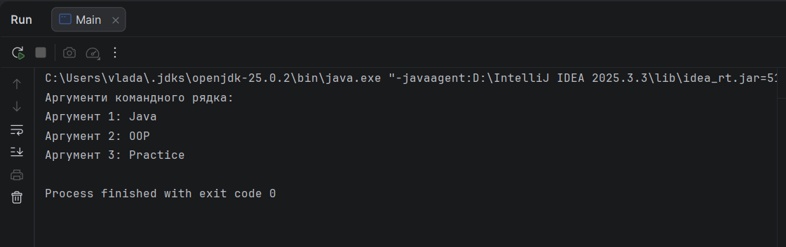

# Завдання 1 — Аргументи командного рядка

Практична робота №1.

Мета:
Розробити програму для роботи з аргументами командного рядка.
## Структура робіт

Функціонал:
- Виведення аргументів
- Перевірка наявності аргументів
- Обробка введених значень
## Результат роботи
