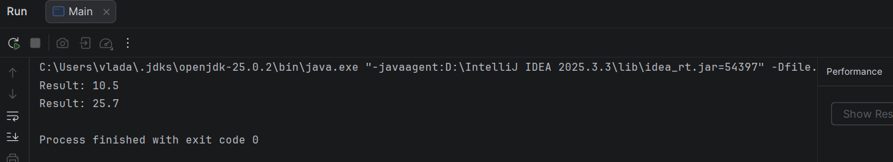

# Завдання 3 – Спадкування

## Мета
Розробити ієрархію класів з використанням шаблону проєктування Factory Method.

## Реалізовано

- Інтерфейс `Displayable` для відображення результатів
- Клас `CalcResult`, що реалізує інтерфейс
- Колекція `ResultCollection` для збереження результатів
- Інтерфейс `ResultFactory`
- Клас `SimpleResultFactory`, що створює об'єкти результатів
- Клас `Main` для демонстрації роботи програми

## Приклад роботи програми

