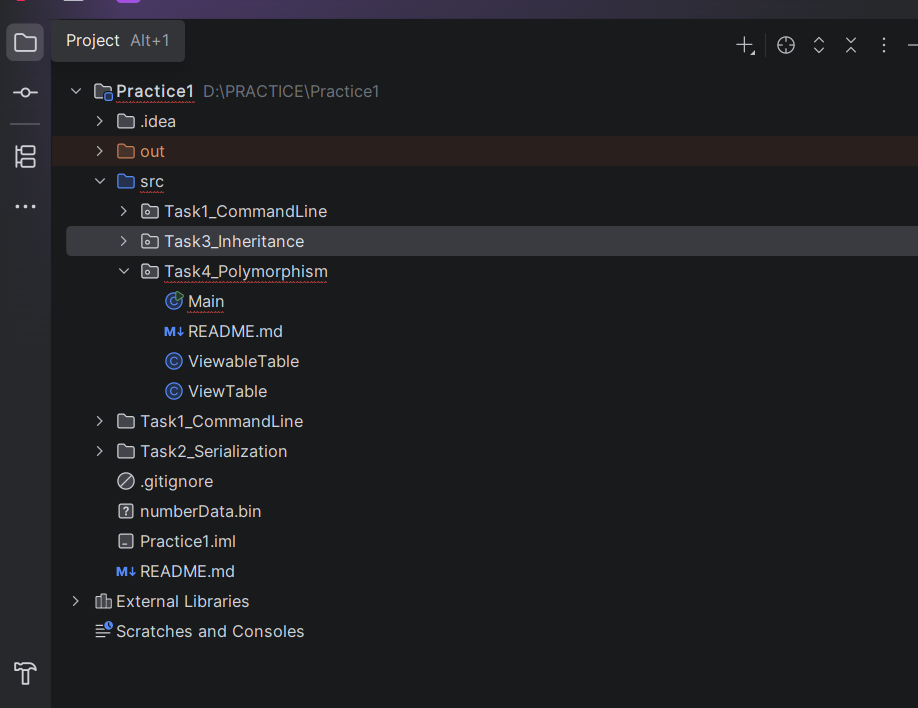
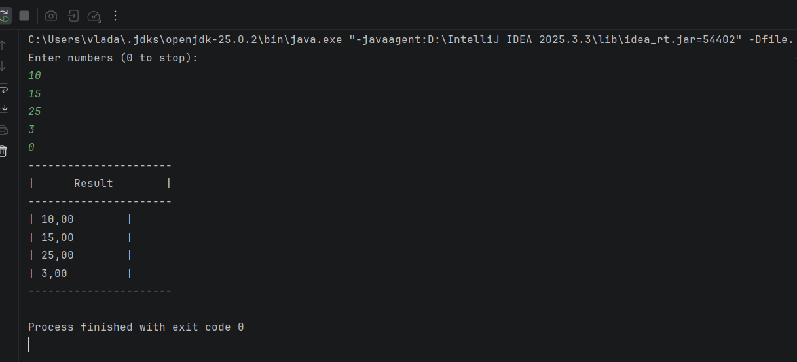

---
## 🔹 Завдання 4 – Поліморфізм
### Мета
- Реалізувати використання поліморфізму
- Використати шаблон Factory Method
- Вивести результати обчислень у вигляді таблиці

### Реалізовано
- `ViewTable` — клас для відображення таблиці результатів
- `ViewableTable` — фабрика створення результатів
- `Main` — введення даних користувачем
- Використання поліморфізму при роботі з об'єктами `CalcResult`

### Приклад роботи програми
