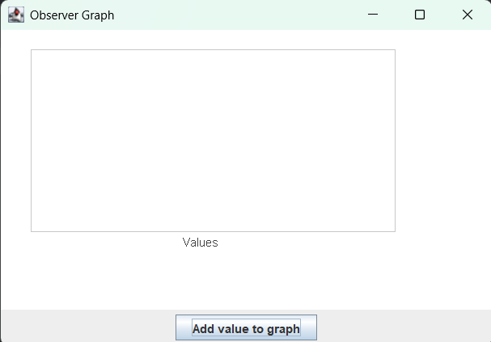
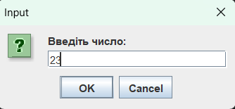
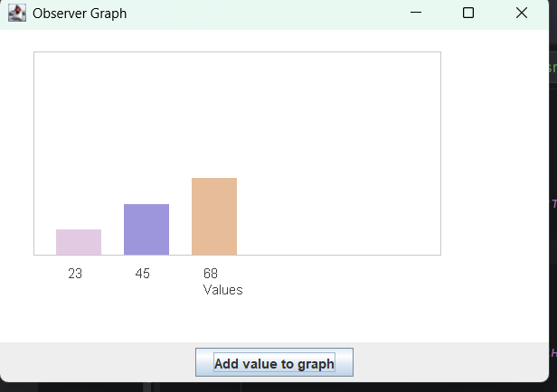
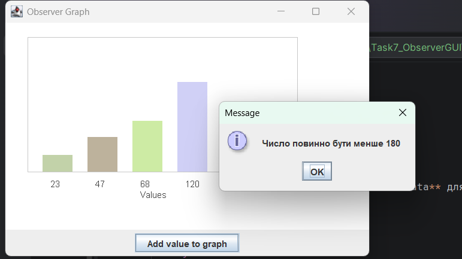
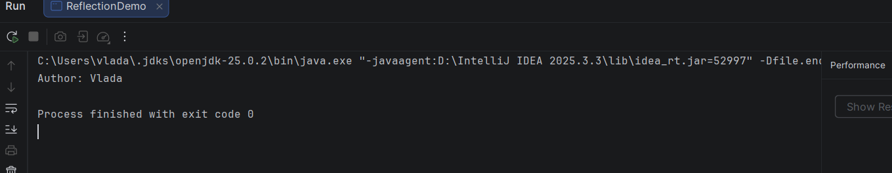

# Завдання 7 – Графічний інтерфейс та шаблон Observer

У даній практичній роботі було реалізовано програму на Java, яка демонструє використання шаблону проектування **Observer**, власних **анотацій**, механізму **Reflection**, а також створення **графічного інтерфейсу за допомогою Swing**.

Програма працює з колекцією числових значень та відображає їх у вигляді **стовпчикового графіка**.  
Користувач може вводити нові значення, після чого графік автоматично оновлюється.

Для організації взаємодії між компонентами використано шаблон **Observer**.

---

## Структура програми

Observable (об'єкт, за яким спостерігають):

**CollectionManager**

Відповідає за:
- зберігання колекції чисел
- додавання нових значень
- повідомлення спостерігачів про зміну даних

---

Observers (спостерігачі):

**ConsoleObserver**

Відслідковує зміну колекції та виводить повідомлення у консоль.

**GraphObserver**

Відповідає за оновлення графіка та перемальовує графічну панель при зміні даних.

---

## Графічний інтерфейс

Графічний інтерфейс реалізовано за допомогою **Java Swing**.

Основні можливості програми:

- відображення чисел у вигляді стовпчикового графіка
- використання пастельних кольорів для стовпчиків
- підпис значень під графіком
- рамка області графіка
- вісь значень
- можливість вводити нові числа

Після введення нового значення графік автоматично оновлюється.

---

## Приклад роботи програми

### Графічний інтерфейс програми

---

### Введення нового значення користувачем

---

### Оновлення графіка після додавання значення

---

## Анотації

У програмі створено власну анотацію:

`@Info`

Анотація використовується у класі **NumberData** для збереження інформації про автора.

---

## Reflection

Для отримання інформації про анотацію використовується механізм **Reflection**.

Клас **ReflectionDemo** демонструє отримання інформації про анотацію під час виконання програми.

Після запуску у консолі виводиться інформація про автора.

---

### Приклад роботи Reflection

---

## Висновок

У результаті виконання роботи було:

- реалізовано шаблон проектування **Observer**
- створено **графічний інтерфейс на Swing**
- використано **власні анотації**
- продемонстровано використання **Reflection**
- реалізовано динамічне оновлення графіка при зміні колекції